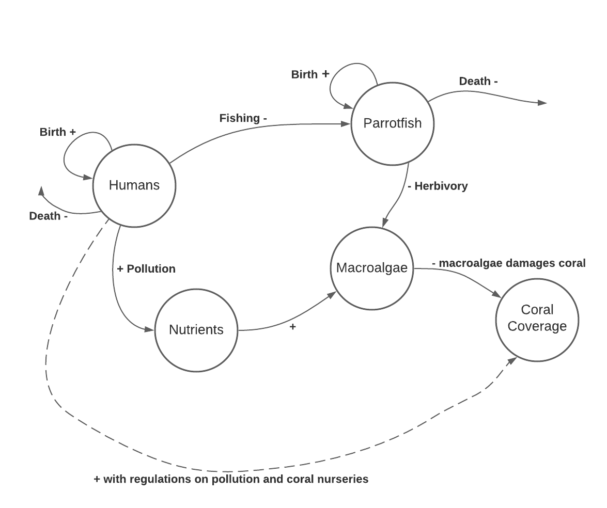
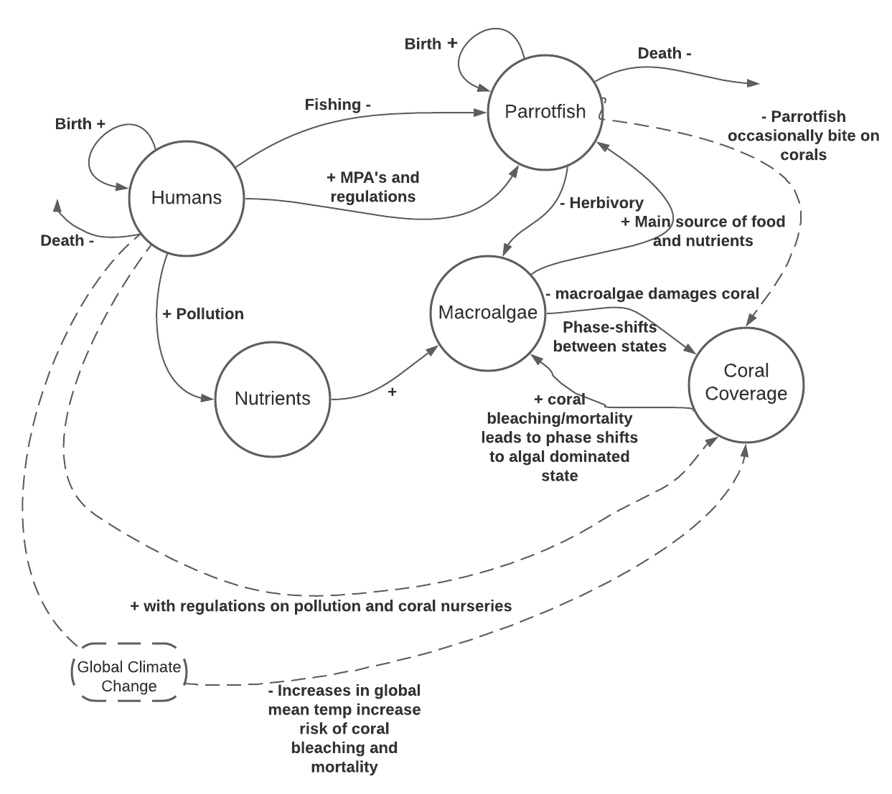
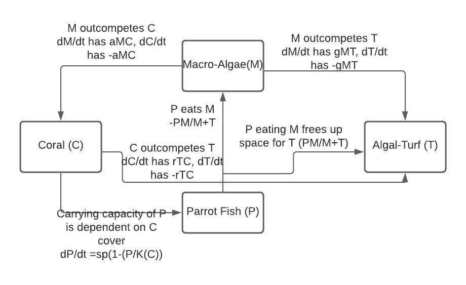
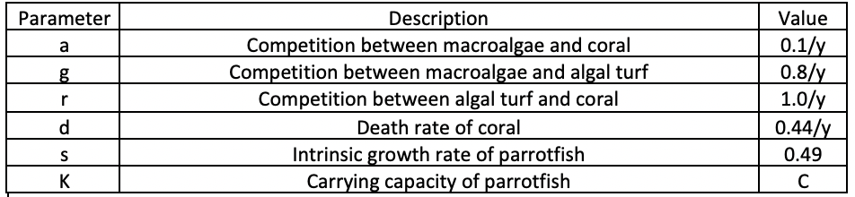
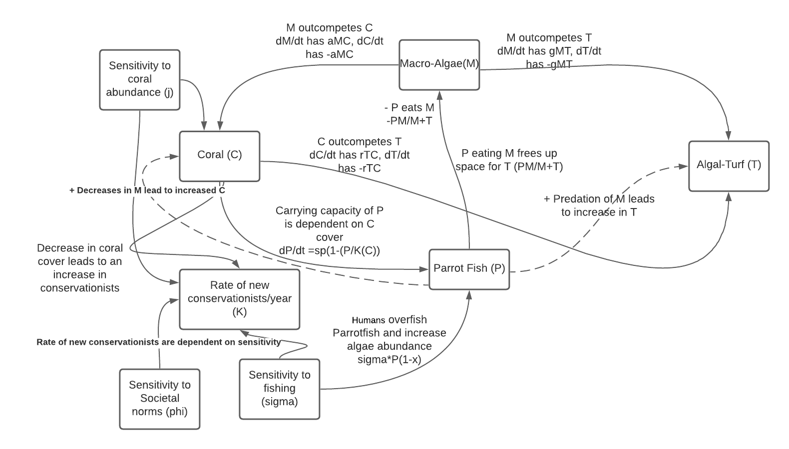

```{r setup, include=FALSE}
knitr::opts_chunk$set(echo = TRUE)
```
#### Part A

##### 1.
Individual Flow Diagram:


##### 2. 
Group Flow Diagram:


##### 3.
Model Flow Diagram:



##### 4.
```{r}
require(deSolve)

# Initial values
state <- c(M = 0.05, C = 0.9, T = 0.05, P = 0.4)
times <- seq(0,100,by=0.1)


# Parameters
parameters <- c(a = 0.1,g=0.8,r=1.0,d=0.44,s=0.49,K=10)


# Model
coral_model <- function(t,state,parameters){
  with(as.list(c(state,parameters)),{
    dM <- (a*M*C) -((P*M)/(M + T))+ (g*M*T)
    dC <- (r*T*C)-(d*C)-(a*M*C)
    dT <- ((P*M)/(M + T))-(g*M*T)-(r*T*C)+(d*C)
    dP <- (s*P)*(1-(P/K))
    list(c(dM,dC,dT,dP))   
  })}
```
##### 5.
```{r}
# Solve model and plot results
out <- ode(y = state,times=times,func=coral_model,parms=parameters)
par(mfrow=c(1,1))
plot(out,ylab='N',xlab='time',las=1, xlim=c(0,10))
```

a. With the parameters set as the given values, the macroalgae and coral populations will decline quickly.The algalturf will grow quickly and the parrotfish population will also grow, but at a slower rate. 

b. The parameter that would have the greatest impact on the population is 'd', the death rate of coral. A 0.2 increase in 'd' will cause the coral to decline to a lower equilibrium value. The algal turf will increase to a greater equilibrium value.

```{r, echo=FALSE}
require(deSolve)

# Initial values
state <- c(M = 0.05, C = 0.9, T = 0.05, P = 0.4)
times <- seq(0,100,by=0.1)


# Parameters
parameters <- c(a = 0.2,g=0.8,r=1.0,d=0.44,s=0.49,K=10)


# Model
coral_model <- function(t,state,parameters){
  with(as.list(c(state,parameters)),{
    dM <- (a*M*C) -((P*M)/(M + T))+ (g*M*T)
    dC <- (r*T*C)-(d*C)-(a*M*C)
    dT <- ((P*M)/(M + T))-(g*M*T)-(r*T*C)+(d*C)
    dP <- (s*P)*(1-(P/K))
    list(c(dM,dC,dT,dP))   
  })}
out <- ode(y = state,times=times,func=coral_model,parms=parameters)
par(mfrow=c(1,1))
plot(out,ylab='N',xlab='time',las=1, xlim=c(0,10))
```

#### Part B

##### 7. 


##### 8.
  In our group we decided that coral coverage and fishing efforts would have the greatest impacts on the system.

##### 9.
```{r}
# Coupled socio-environmental coral reef model 
# Created by Easton R. White
# Edited on 7-Aug-2019
# From Thampi et al. 2018 paper https://www.nature.com/articles/s41598-018-20341-0#Sec6

require(deSolve)
coupled_model <- function(Time, State, Pars) {
  with(as.list(c(State, Pars)), {
    dM <-  a*M*C - (P*M)/(M+T) + gamma*M*T
    dC <-  r*T*C - d*C - a*M*C
    dT <- (P*M)/(M+T) - gamma*M*T - r*T*C + d*C
    dP <- s*P*(1 - P/C) - sigma*P*(1 - X)
    dX <- kappa*X*(1 - X)*(-1 + j*(1 - C) - sigma*P*(1 - X) + phi*(2*X - 1))
    return(list(c(dM,dC,dT,dP,dX)))  
  })
}

pars <- c(a = 0.1, gamma = 0.8, r = 1.0, d = 0.44, s = 0.49, sigma = 0.5, kappa= 1.014, j=1.68, sigma = 0.5, phi = 0.2)


yini  <- c(M = 0.05, C = 0.9, T = 0.05, P = 0.4, X = 0.5)
times <- seq(0, 100, by = 0.1)
```

##### 10.
```{r}
out   <- ode(yini, times, coupled_model, pars)

par(mfrow=c(1,2))
matplot(out[ , 1], out[ , 2:5], type = "l", xlab = "time", ylab = "Percent cover",main = "Ecological dynamics", lwd = 2,ylim=c(0,1))
legend('topright',legend = c('macroalgae','coral reef','turf algae','parrotfish'),col = c(1,2,3,4),pch = 18)

matplot(out[ , 1], out[ , 6], type = "l", xlab = "time", ylab = "Fraction that are conservationists",main = "Conservation opinion", lwd = 2,ylim=c(0,1),col=5)
```

a. With the given parameters the coral cover will decrease rapidly at first, it will then have a short period of slower decline, then it will continue to decline rapidly to 0. The turf algae will increase at first, peaking at 0.4, then it will also decline to zero. The parrotfish will also decline to zero. Macroalgae cover will increase to 100% as the others drop to zero. The conservation opinion will decline at first, and then it will increase rapidly shortly after the coral, turf alga, and parrotfish drop to zero.

b. The parameters that have the greatest effects on the model are gamma, d, and sigma. A decrease of 0.3 in gamma, competition between macroalgae and turf, yields the following model. In this model coral, algal turf, and parrotfish will take longer to decline and it will take much longer for people to  become conservationists.
```{r, echo = FALSE}
require(deSolve)
coupled_model <- function(Time, State, Pars) {
  with(as.list(c(State, Pars)), {
    dM <-  a*M*C - (P*M)/(M+T) + gamma*M*T
    dC <-  r*T*C - d*C - a*M*C
    dT <- (P*M)/(M+T) - gamma*M*T - r*T*C + d*C
    dP <- s*P*(1 - P/C) - sigma*P*(1 - X)
    dX <- kappa*X*(1 - X)*(-1 + j*(1 - C) - sigma*P*(1 - X) + phi*(2*X - 1))
    return(list(c(dM,dC,dT,dP,dX)))  
  })
}

pars <- c(a = 0.1, gamma = 0.5, r = 1.0, d = 0.44, s = 0.49, sigma = 0.5, kappa= 1.014, j=1.68, sigma = 0.5, phi = 0.2)


yini  <- c(M = 0.05, C = 0.9, T = 0.05, P = 0.4, X = 0.5)
times <- seq(0, 100, by = 0.1)

out   <- ode(yini, times, coupled_model, pars)

par(mfrow=c(1,2))
matplot(out[ , 1], out[ , 2:5], type = "l", xlab = "time", ylab = "Percent cover",main = "Ecological dynamics", lwd = 2,ylim=c(0,1))
legend('topright',legend = c('macroalgae','coral reef','turf algae','parrotfish'),col = c(1,2,3,4),pch = 18)

matplot(out[ , 1], out[ , 6], type = "l", xlab = "time", ylab = "Fraction that are conservationists",main = "Conservation opinion", lwd = 2,ylim=c(0,1),col=5)
```
An increase in d, the death rate of coral, will also have major impacts on the model. When d is increased by 0.2 the decline of populations will occur much faster, and people will become conservationists at a much faster rate.
```{r, echo = FALSE}
require(deSolve)
coupled_model <- function(Time, State, Pars) {
  with(as.list(c(State, Pars)), {
    dM <-  a*M*C - (P*M)/(M+T) + gamma*M*T
    dC <-  r*T*C - d*C - a*M*C
    dT <- (P*M)/(M+T) - gamma*M*T - r*T*C + d*C
    dP <- s*P*(1 - P/C) - sigma*P*(1 - X)
    dX <- kappa*X*(1 - X)*(-1 + j*(1 - C) - sigma*P*(1 - X) + phi*(2*X - 1))
    return(list(c(dM,dC,dT,dP,dX)))  
  })
}

pars <- c(a = 0.1, gamma = 0.8, r = 1.0, d = 0.64, s = 0.49, sigma = 0.5, kappa= 1.014, j=1.68, sigma = 0.5, phi = 0.2)


yini  <- c(M = 0.05, C = 0.9, T = 0.05, P = 0.4, X = 0.5)
times <- seq(0, 100, by = 0.1)

out   <- ode(yini, times, coupled_model, pars)

par(mfrow=c(1,2))
matplot(out[ , 1], out[ , 2:5], type = "l", xlab = "time", ylab = "Percent cover",main = "Ecological dynamics", lwd = 2,ylim=c(0,1))
legend('topright',legend = c('macroalgae','coral reef','turf algae','parrotfish'),col = c(1,2,3,4),pch = 18)

matplot(out[ , 1], out[ , 6], type = "l", xlab = "time", ylab = "Fraction that are conservationists",main = "Conservation opinion", lwd = 2,ylim=c(0,1),col=5)
```
Changes in sigma, fishing rate, will also impact the model. A decrease in fishing effort will cause macroalgae to decline due to the stable parrotfish population consuming it. Coral cover will decline to an equilibrium slightly below 60%, algal turf will increase to an equilibrium slightly above 40%. In this scenario, people will not become conservationists.
```{r, echo = FALSE}
require(deSolve)
coupled_model <- function(Time, State, Pars) {
  with(as.list(c(State, Pars)), {
    dM <-  a*M*C - (P*M)/(M+T) + gamma*M*T
    dC <-  r*T*C - d*C - a*M*C
    dT <- (P*M)/(M+T) - gamma*M*T - r*T*C + d*C
    dP <- s*P*(1 - P/C) - sigma*P*(1 - X)
    dX <- kappa*X*(1 - X)*(-1 + j*(1 - C) - sigma*P*(1 - X) + phi*(2*X - 1))
    return(list(c(dM,dC,dT,dP,dX)))  
  })
}

pars <- c(a = 0.1, gamma = 0.8, r = 1.0, d = 0.44, s = 0.49, sigma = 0.3, kappa= 1.014, j=1.68, sigma = 0.5, phi = 0.2)


yini  <- c(M = 0.05, C = 0.9, T = 0.05, P = 0.4, X = 0.5)
times <- seq(0, 100, by = 0.1)

out   <- ode(yini, times, coupled_model, pars)

par(mfrow=c(1,2))
matplot(out[ , 1], out[ , 2:5], type = "l", xlab = "time", ylab = "Percent cover",main = "Ecological dynamics", lwd = 2,ylim=c(0,1))
legend('topright',legend = c('macroalgae','coral reef','turf algae','parrotfish'),col = c(1,2,3,4),pch = 18)

matplot(out[ , 1], out[ , 6], type = "l", xlab = "time", ylab = "Fraction that are conservationists",main = "Conservation opinion", lwd = 2,ylim=c(0,1),col=5)
```